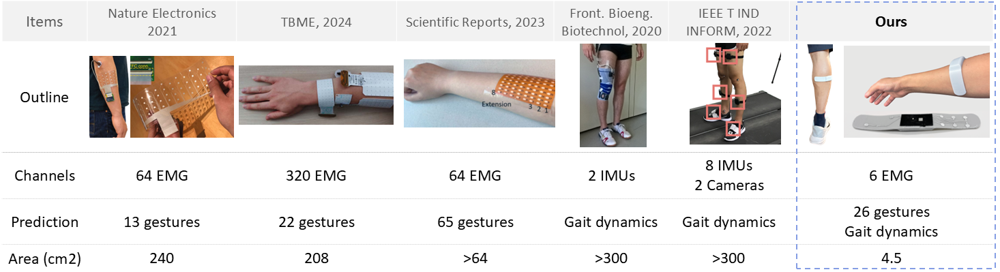

# GenENet
#### A modular framework for self-supervised pretraining and downstream evaluation of EMG gesture prediction using GenENet.
---

**[Kyun Kyu Kim](https://kyunkyukim.com)\#<sup>1</sup>, [Zhenan Bao](https://baogroup.stanford.edu)\*<sup>1</sup>**  
<sup>1</sup>Stanford University, CA, USA. Please refer manuscript for full author list. 

<!--  [](https://arxiv.org/abs/2504.11295)&nbsp;   -->

## Overview
<i>We propose a Generative Electromyography Network (GenENet), a generative algorithm combined with wearable sensor that extrapolates limited sensor counts to reconstruct muscle activity in unseen regions. This approach allows for gathering information equivalent to those from high-density EMG sensor networks, but using a more compact, wearable device with much reduced sensor counts, without sacrificing performance</i>



##  Setup


### 1. Clone respository  

Clone this repository and navigate to the root directory.
```bash
git clone https://github.com/richkim92/GenENet.git
cd GenENet
```
---

### 2. Set up data

Sample dataset is stored in /dataset. Modify paths in `params.py` if needed.  
To download pretrained checkpoint `model.pt`, run:

```bash
python -m utils.download_model --model-name model
```
---

### 3. Pretraining

Run masked self-supervised pretraining. This will drive representation learning of entire 32 channels. 

```bash
python pretrain/train_pre.py
```
---

### 4. Downstream Classification

Run fine-tuning using pretrained encoder and downstream LSTM:

```bash
python downstream/train_post.py
```

By default, it loads the checkpoint from `./model_pt/model.pt`.

---

## Results

| Task                  | Accuracy |
|-----------------------|----------|
| EMG Sign Language Translation   | 93.6 %    |
| EMG Gait Force Prediction | 6.21 % (Relative RSME)    |

---

## Author

- Kyun Kyu (Richard) Kim ([@richkim92](https://github.com/richkim92))
- Contact: enthusiakk@gmail.com
- Affiliation: Stanford University

---

## License

This project is licensed under the MIT License - see the LICENSE file for details.
