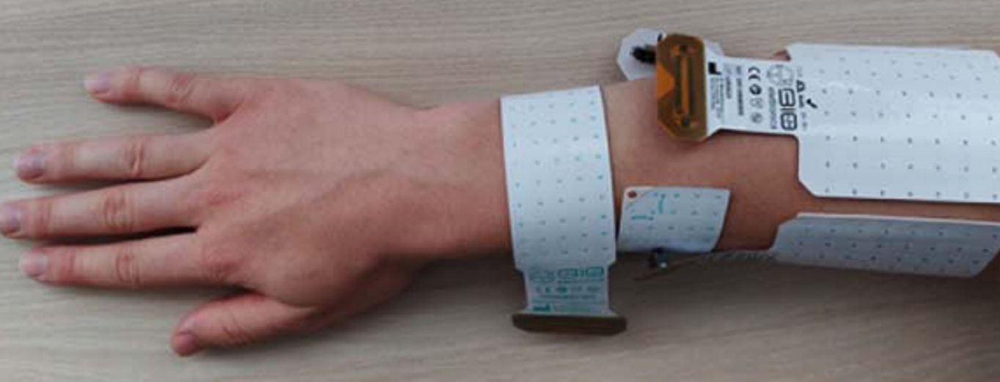
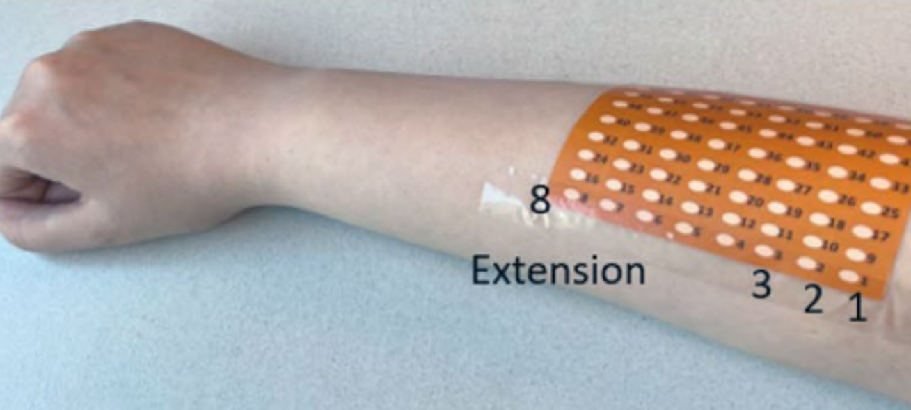
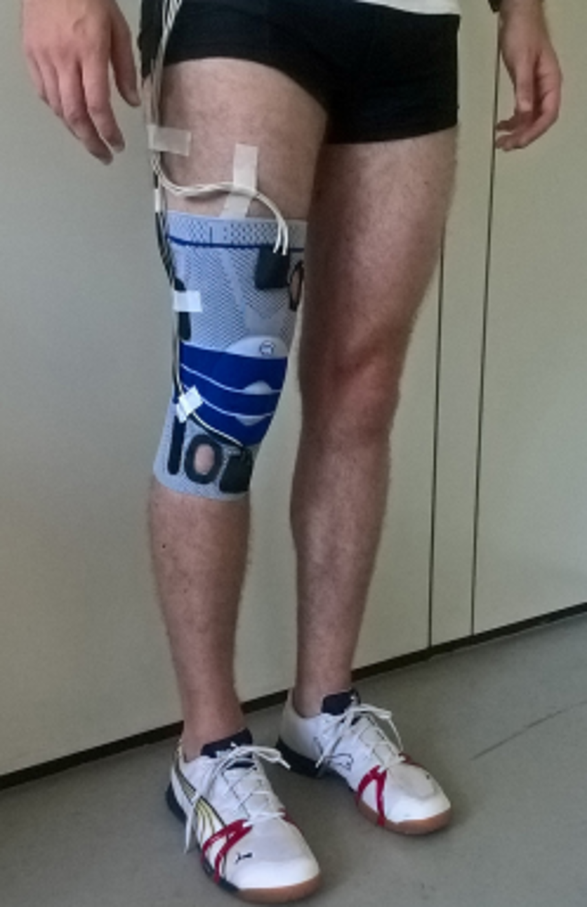
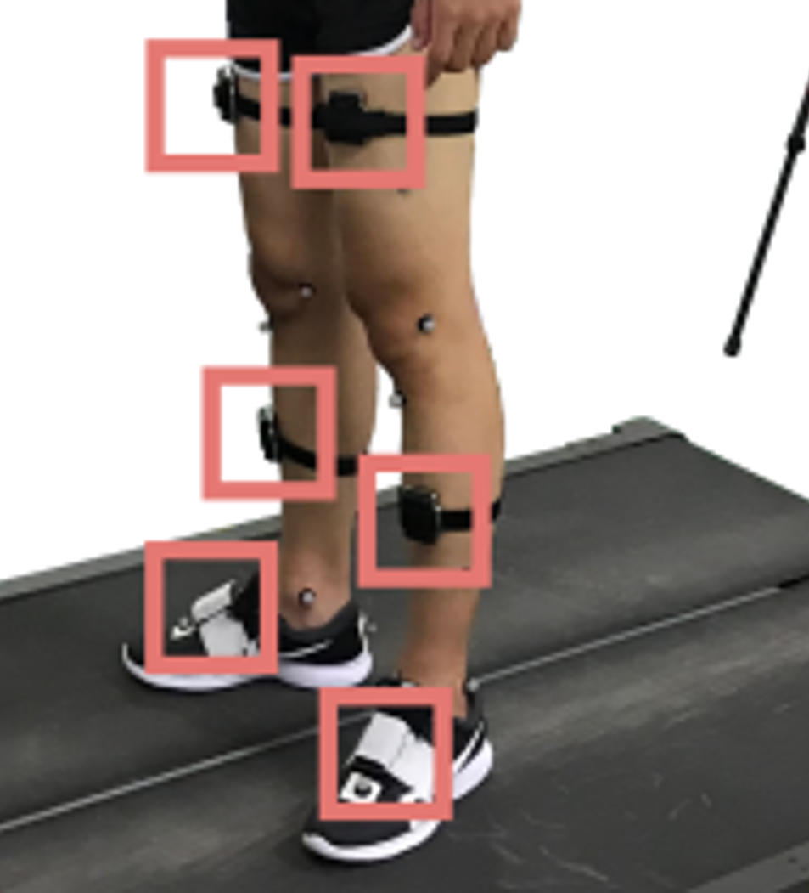

# A simplified low‑channel EMG sensing for human‑machine interfaces
#### A modular framework for generative representation learning and downstream evaluation of EMG gesture prediction using low-channel wearble EMG device.
---

**[Kyun Kyu Kim](https://kyunkyukim.com)\#<sup>1</sup>, [Zhenan Bao](https://baogroup.stanford.edu)\*<sup>1</sup>**  
<sup>1</sup>Stanford University, CA, USA. Please refer manuscript for full author list. 

<!--  [](https://arxiv.org/abs/2504.11295)&nbsp;   -->

## Overview
We propose a Generative Electromyography Network (GenENet), a representation learning framework integrated with a wearable sensor system that leverages a simple, low‑channel‑count device to predict a broad spectrum of body kinematics traditionally reliant on high‑density EMG sensor arrays. This approach enables acquisition of information comparable to that obtained from high‑density EMG networks while using a more compact and wearable device with significantly fewer sensors, without compromising performance in human‑computer interaction tasks.
<!---->
| <div align="center"><small>Year</small></div> | <div align="center"><small>2021<sup>[1]</sup></small></div> | <div align="center"><small>2024<sup>[2]</sup></small></div> | <div align="center"><small>2023<sup>[3]</sup></small></div> | <div align="center"><small>2020<sup>[4]</sup></small></div> | <div align="center"><small>2022<sup>[5]</sup></small></div> | <div align="center"><small>**Ours**</small></div> |
|-------|-------------------------|------------|--------------------------|--------------------------------|------------------------|------|
| <div align="center"><small><b>Outline</b></small></div> | <div align="center"></div> | <div align="center"></div> | <div align="center"></div> | <div align="center"></div> | <div align="center"></div> | <div align="center"></div> |
| <div align="center"><small><b>Channels</b></small></div> | <div align="center"><small>64 EMG</small></div> | <div align="center"><small>320 EMG</small></div> | <div align="center"><small>64 EMG</small></div> | <div align="center"><small>2 IMUs</small></div> | <div align="center"><small>8 IMUs,<br>2 Cameras</small></div> | <div align="center"><small>**6 EMG**</small></div> |
| <div align="center"><small><b>Prediction</b></small></div> | <div align="center"><small>13 gestures</small></div> | <div align="center"><small>22 gestures</small></div> | <div align="center"><small>65 gestures</small></div> | <div align="center"><small>Gait dynamics</small></div> | <div align="center"><small>Gait dynamics</small></div> | <div align="center"><small>**26 gestures,<br> Gait dynamics**</small></div> |
| <div align="center"><small><b>Area (cm²)</b></small></div> | <div align="center"><small>240</small></div> | <div align="center"><small>208</small></div> | <div align="center"><small>>64</small></div> | <div align="center"><small>>300</small></div> | <div align="center"><small>>300</small></div> | <div align="center"><small>**4.5**</small></div> |


<sub>
**References**  
[1] Nature Electronics, 2021  
[2] IEEE TBME, 2024  
[3] Scientific Reports, 2023  
[4] Front. Bioeng. Biotechnol, 2020  
[5] IEEE Transactions on Industrial Informatics, 2022
</sub>


##  Setup


### 1. Clone respository  

Clone this repository and navigate to the root directory.
```bash
git clone https://github.com/richkim92/GenENet.git
cd GenENet
```
---

### 2. Set up data

Sample dataset is stored in /dataset. Modify paths in `params.py` if needed.  
To download pretrained checkpoint `model.pt`, run:

```bash
python -m utils.download_model --model-name model
```
---

### 3. Pretraining

Run masked self-supervised pretraining. This will drive representation learning of entire 32 channels. 

```bash
python pretrain/train_pre.py
```
---

### 4. Downstream Classification

Run fine-tuning using pretrained encoder and downstream LSTM:

```bash
python downstream/train_post.py
```

By default, it loads the checkpoint from `./model_pt/model.pt`.

---

## Results

| Task                  | Accuracy |
|-----------------------|----------|
| EMG Sign Language Translation   | 93.6 %    |
| EMG Gait Force Prediction | 6.21 % (Relative RSME)    |

---

## Author

- Kyun Kyu (Richard) Kim ([@richkim92](https://github.com/richkim92))
- Contact: enthusiakk@gmail.com
- Affiliation: Stanford University

---

## License

This project is licensed under the MIT License - see the LICENSE file for details.
